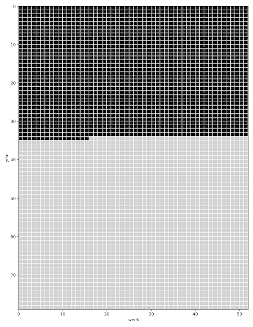

## lifeweeks.py — make a figure of the progress of your life

Install requisite packages with:

    conda create --name simple numpy scipy matplotlib
    conda activate simple

Run by changing your birthday (and optionally your life expectancy) in `lifeweeks.py` and run:

    python lifeweeks.py

